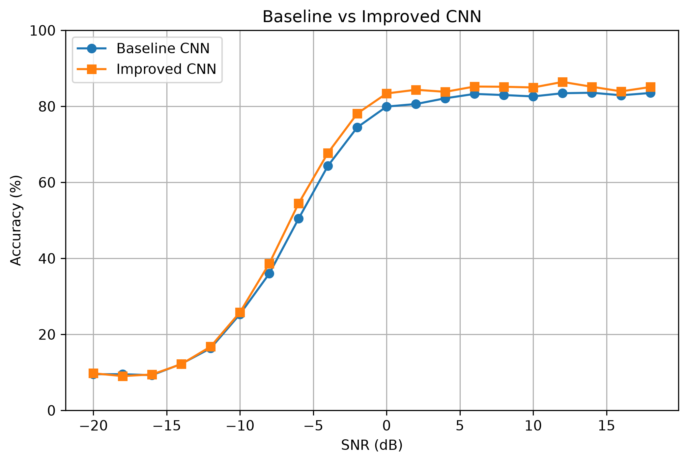
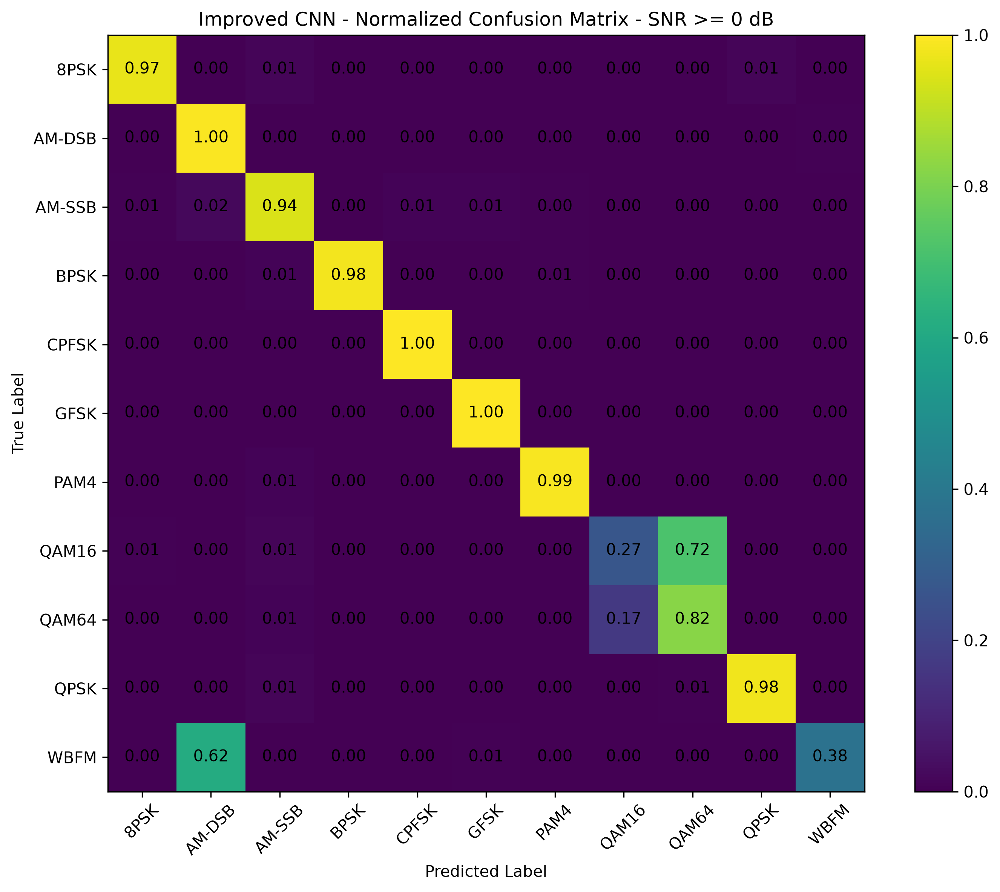

# Wireless Modulation Classification with 1D CNN

A deep learning project for automatic modulation classification (AMC) using raw I/Q signals from the RadioML 2016.10a dataset.

This project implements a baseline 1D convolutional neural network (CNN) and an improved CNN for classifying 11 wireless modulation types. Model performance is evaluated across different signal-to-noise ratio (SNR) conditions using accuracy curves and confusion matrices.

## Project Overview

Automatic Modulation Classification (AMC) aims to identify the modulation type of a received wireless signal automatically.

In this project, raw I/Q samples are directly used as the input to a 1D CNN:

- Input shape: `(2, 128)`
- 2 channels: In-phase (I) and Quadrature (Q)
- 128 time-domain samples per signal
- 11 modulation classes
- SNR range: -20 dB to 18 dB

The project follows the workflow:

```text
RadioML Dataset
      ↓
Data Preprocessing
      ↓
Train / Validation / Test Split
      ↓
Baseline 1D CNN
      ↓
Training and Evaluation
      ↓
Accuracy vs SNR + Confusion Matrix
      ↓
Model Improvement
      ↓
Baseline vs Improved CNN
```

## Dataset

The project uses the RadioML 2016.10a dataset.

The dataset contains 220,000 signal samples covering 11 modulation types and 20 SNR levels.

### Modulation Classes

```text
8PSK
AM-DSB
AM-SSB
BPSK
CPFSK
GFSK
PAM4
QAM16
QAM64
QPSK
WBFM
```

The SNR values range from:

```text
-20 dB to 18 dB
```

with a step size of 2 dB.

Each signal sample has the shape:

```text
(2, 128)
```

representing two I/Q channels and 128 time-domain samples.

The dataset is split into:

- Training set: 70%
- Validation set: 15%
- Test set: 15%

The split is stratified by modulation type and SNR to maintain a consistent class/SNR distribution across the three subsets.

## Baseline CNN

The baseline model uses a 1D CNN to extract local temporal features directly from raw I/Q signals.

Main components include:

- 1D convolution
- Batch normalization
- ReLU activation
- Max pooling
- Dropout
- Adaptive average pooling
- Fully connected classification layers

The model receives:

```text
(N, 2, 128)
```

and outputs 11 logits corresponding to the 11 modulation classes.

## Improved CNN

After evaluating the baseline model, the CNN architecture was modified to improve feature extraction.

The main changes include:

- Increasing selected convolution kernel sizes from 3 to 5
- Adding an additional deep convolutional layer
- Adjusting dropout rates

The larger convolution kernels provide a wider temporal receptive field, while the additional convolutional layer increases the model's feature extraction capacity.

To make the comparison controlled, the baseline and improved models use the same:

- Dataset split
- Batch size
- Learning rate
- Number of training epochs

## Experimental Results

### Validation Performance

| Model | Best Validation Accuracy |
|---|---:|
| Baseline CNN | 56.4% |
| Improved CNN | 58.4% |

### Accuracy at SNR >= 0 dB

| Model | Accuracy |
|---|---:|
| Baseline CNN | ~82.90% |
| Improved CNN | 84.75% |

The improved CNN increases high-SNR classification accuracy by approximately 1.85 percentage points.

### Baseline vs Improved CNN



At extremely low SNR levels, both models approach the random-guessing accuracy of an 11-class classification problem.

From approximately -8 dB onward, the improved CNN generally achieves higher accuracy than the baseline. At SNR >= 0 dB, the improved model remains around 84-86% accuracy.

## Confusion Matrix Analysis

### Improved CNN — SNR >= 0 dB



Most modulation types achieve high classification accuracy under SNR >= 0 dB.

Several notable changes compared with the baseline model include:

| Class | Baseline | Improved |
|---|---:|---:|
| 8PSK | 91% | 97% |
| GFSK | 98% | 100% |
| QAM64 | 74% | 82% |
| WBFM | 16% | 38% |
| QAM16 | 40% | 27% |

The improved model significantly improves WBFM recognition and reduces part of the original WBFM-to-AM-DSB confusion.

However, QAM16 and QAM64 remain strongly confused. The improved model increases QAM64 accuracy while decreasing QAM16 accuracy, indicating that inter-class confusion between the two QAM modulation types remains an important limitation.

## Accuracy vs SNR

The model performance strongly depends on SNR.

At very low SNR:

```text
-20 dB to -16 dB
```

accuracy is approximately 9%, close to the random baseline:

```text
1 / 11 ≈ 9.09%
```

As SNR increases, classification accuracy rises rapidly.

For the improved CNN:

| SNR | Accuracy |
|---:|---:|
| -10 dB | 25.82% |
| -8 dB | 38.67% |
| -6 dB | 54.48% |
| -4 dB | 67.76% |
| -2 dB | 78.12% |
| 0 dB | 83.39% |
| 6 dB | 85.21% |
| 12 dB | 86.42% |
| 18 dB | 85.09% |

This demonstrates the strong relationship between signal quality and automatic modulation classification performance.

## Project Structure

```text
WirelessModulationCNN/
│
├── src/
│   ├── model.py
│   ├── improved_model.py
│   ├── train.py
│   ├── prepare_dataset.py
│   ├── run_training.py
│   ├── run_training_improved.py
│   ├── test_model.py
│   ├── test_improved_model.py
│   └── compare_models.py
│
├── results/
│   ├── baseline_vs_improved.png
│   ├── accuracy_vs_snr.png
│   ├── improved_accuracy_vs_snr.png
│   ├── confusion_matrix_snr_ge_0.png
│   └── improved_confusion_matrix_snr_ge_0.png
│
├── notebooks/
├── requirements.txt
├── .gitignore
└── README.md
```

## Training

The project is implemented using PyTorch and supports NVIDIA GPU acceleration through CUDA.

Train the baseline model:

```bash
python src/run_training.py
```

Train the improved model:

```bash
python src/run_training_improved.py
```

The best validation checkpoint is automatically saved during training.

## Evaluation

Evaluate the baseline model:

```bash
python src/test_model.py
```

Evaluate the improved model:

```bash
python src/test_improved_model.py
```

Generate the comparison figure:

```bash
python src/compare_models.py
```

## Key Findings

The experiments show that 1D CNNs can learn useful temporal features directly from raw I/Q signals for automatic modulation classification.

Increasing the temporal receptive field and model depth improved overall validation performance and classification accuracy under medium-to-high SNR conditions.

The improved model achieved 84.75% accuracy for SNR >= 0 dB. However, class-level analysis shows that QAM16/QAM64 confusion and WBFM/AM-DSB confusion remain important limitations.

These results demonstrate the importance of evaluating AMC models not only using overall accuracy, but also across different SNR levels and individual modulation classes.

## Future Work

Possible future improvements include:

- Investigating feature representations for QAM16/QAM64 discrimination
- Improving WBFM/AM-DSB classification
- Testing data augmentation techniques
- Comparing CNN with recurrent or attention-based architectures
- Evaluating robustness under additional channel conditions

## Environment

Main dependencies:

```text
Python
PyTorch
NumPy
scikit-learn
Matplotlib
```

GPU acceleration was tested using an NVIDIA GTX 1650 with CUDA-enabled PyTorch.

## Acknowledgements

## Acknowledgements

This project is based on the open-source implementation:

[Radio Modulation Classification with Deep Learning](https://github.com/benyakirdolev/rf-modulation-classification)

The baseline code structure was adapted from the original repository.

My work mainly focused on dataset preparation, stratified train/validation/test splitting, baseline reproduction, model improvement, SNR-based evaluation, confusion-matrix analysis, and baseline-vs-improved comparison.

The RadioML 2016.10a dataset is used for modulation classification experiments.