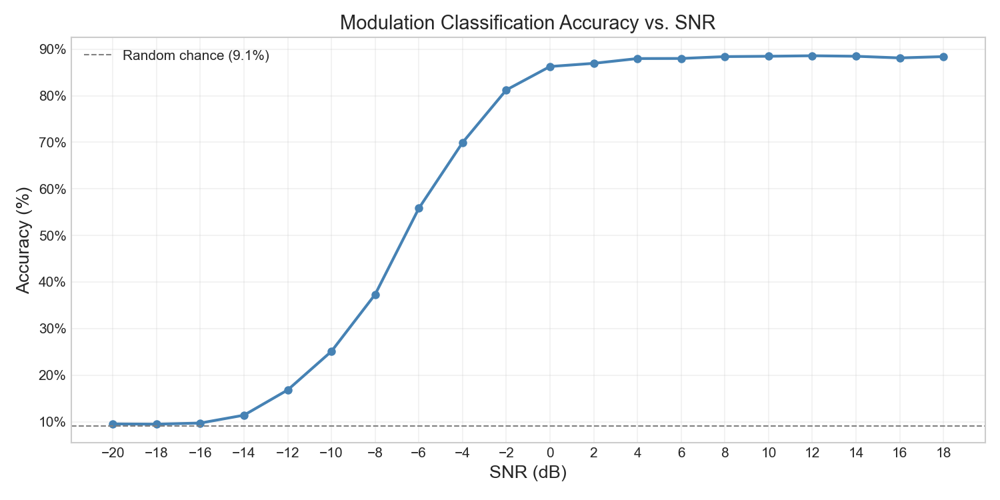
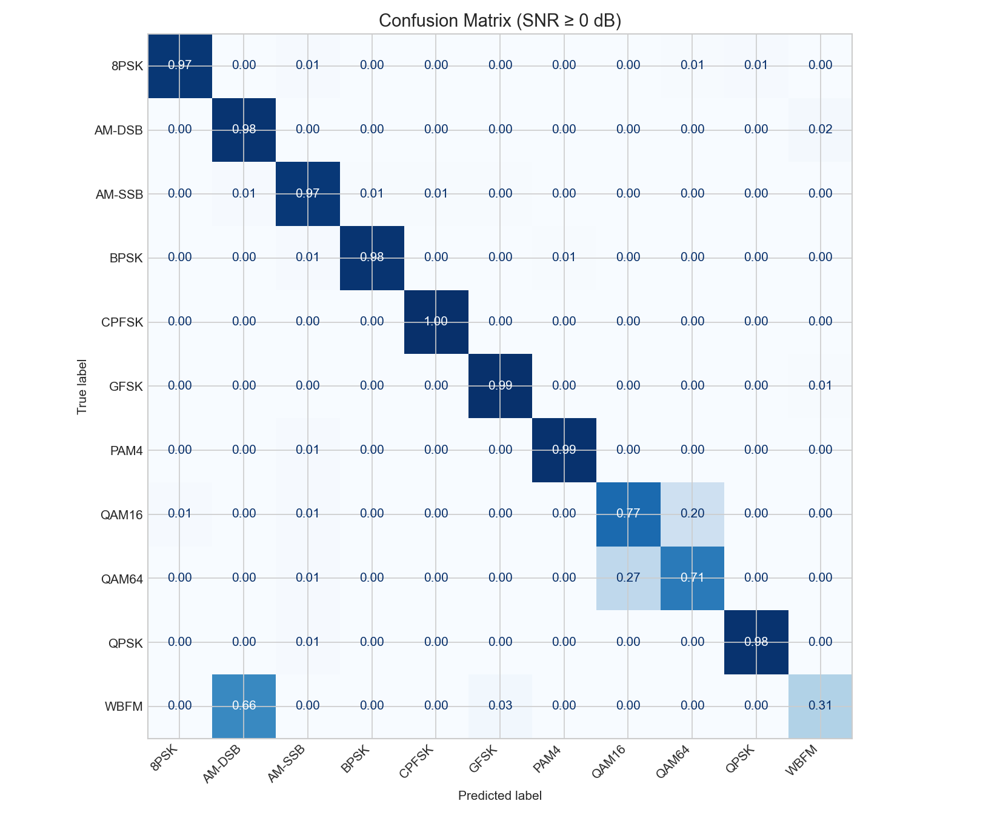
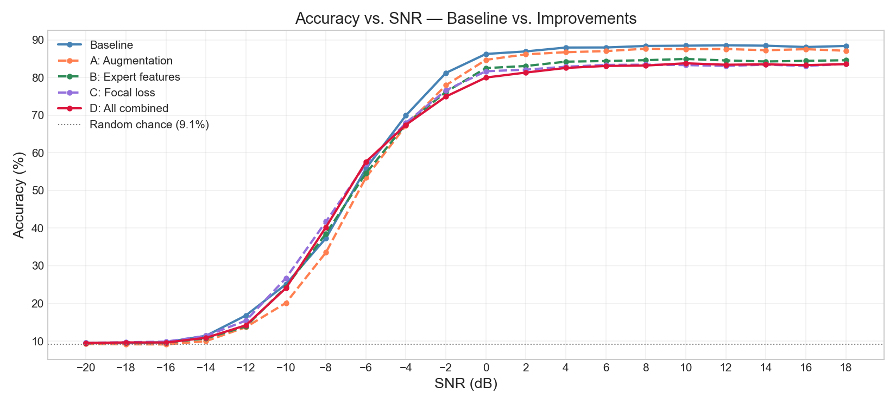

# Radio Modulation Classification with Deep Learning

Classifying radio signal modulation types from raw IQ samples using a CNN — no hand-crafted features, no domain preprocessing.

## Problem

In wireless communications, the receiver must identify how a signal was modulated before it can decode it. Modulation classification is challenging at low SNR, where noise overwhelms the signal structure that distinguishes modulation types. This project trains a CNN directly on raw in-phase/quadrature (IQ) samples to learn those distinctions end-to-end.

## Dataset

[RadioML 2016.10a](https://www.deepsig.ai/datasets) — 11 modulation types × 20 SNR levels (−20 to +18 dB) × 1,000 samples = 220,000 total examples. Each sample is a (2 × 128) array representing 128 IQ snapshots.

Modulation classes: `8PSK`, `AM-DSB`, `AM-SSB`, `BPSK`, `CPFSK`, `GFSK`, `PAM4`, `QAM16`, `QAM64`, `QPSK`, `WBFM`

## Model

A three-block 1D CNN operating directly on IQ time series:

```
Input (2 × 128)
  → Conv Block 1: Conv1D(64) × 2 + MaxPool → (64 × 64)
  → Conv Block 2: Conv1D(128) × 2 + MaxPool → (128 × 32)
  → Conv Block 3: Conv1D(256) + GlobalAvgPool → (256,)
  → FC(128) → FC(11)
```

BatchNorm and Dropout after each block. Trained with Adam + cosine LR schedule for 30 epochs.

## Results

**88% accuracy at SNR ≥ 0 dB. Near-random at −20 dB — as expected, no classifier can recover modulation structure when noise dominates the signal.**

### Accuracy vs. SNR



### Confusion Matrix (SNR ≥ 0 dB)



Most modulations are classified with ≥96% accuracy. The two failure modes are physically motivated:
- **QAM16 ↔ QAM64**: same square grid geometry, different density — hard to separate in 128 samples at low-to-mid SNR
- **WBFM → AM-DSB**: both analog amplitude modulations with similar IQ structure

### Improvement Experiments

Three techniques were tested against the baseline: phase rotation augmentation, instantaneous amplitude/phase as extra input channels, and focal loss. All underperformed the baseline at 30 epochs — see the notebook discussion for analysis and further directions.



## Quickstart

```bash
# 1. Download the dataset
#    https://www.deepsig.ai/datasets → RadioML 2016.10a → place in data/

# 2. Install dependencies
pip install -r requirements.txt

# 3. Run the notebook
jupyter notebook notebooks/modulation_classification.ipynb
```

## Project Structure

```
modulation-classifier/
├── src/
│   ├── dataset.py       # RadioML dataset loader with augmentation + expert features
│   ├── model.py         # 1D CNN architecture
│   ├── train.py         # training loop with checkpointing
│   ├── evaluate.py      # accuracy vs SNR, confusion matrix
│   └── focal_loss.py    # focal loss implementation
├── notebooks/
│   └── modulation_classification.ipynb
├── results/figures/     # saved plots
└── checkpoints/         # model weights (gitignored)
```
